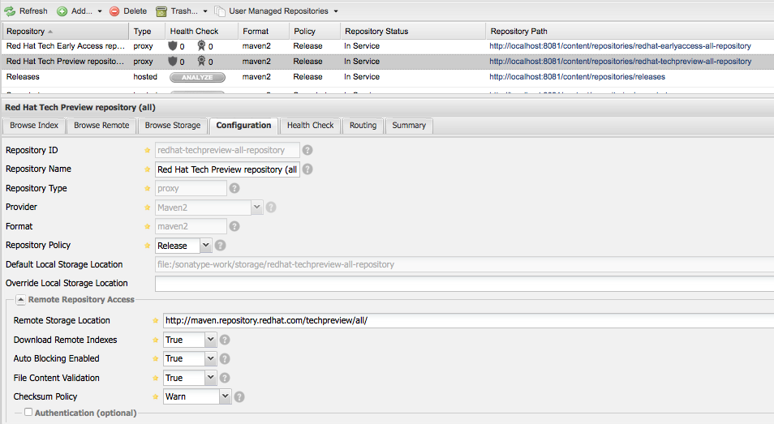
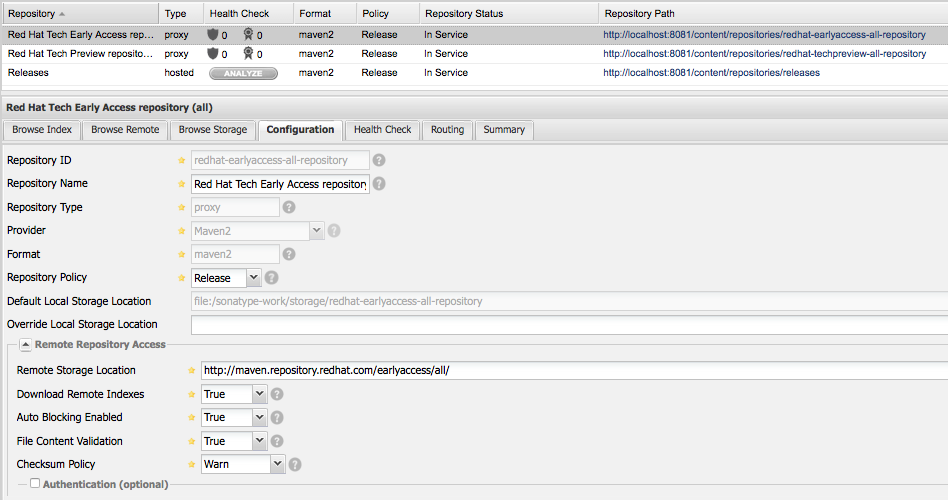
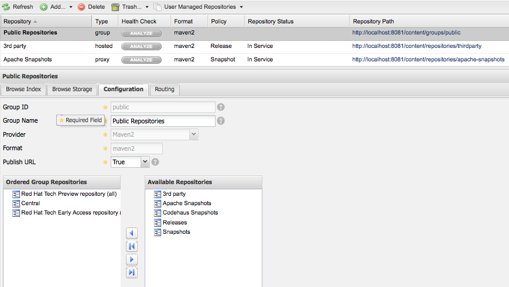

:noaudio:
:data-uri:
:toc2:

= Nexus configuration

. To execute the Nexus within a container run:
+

[source,console,numbered]
-----
docker run -d -p 8081:8081 --name nexus sonatype/nexus:oss
-----
+
. Nexus will start listening to the port `8081` and the credentials are `admin/admin123`.
. The `pom.xml` must be changed to point to the Nexus instance using the container IP or `localhost` if you are building from local and using nexus as proxy:
+ 

[source,xml,numbered]
-----
<repositories>
    <repository>
    <id>Samuel Repository</id>
    <url>http://172.17.0.3:8081/content/groups/public/</url>
    </repository>
</repositories>
<pluginRepositories>
    <pluginRepository>
    <id>Samuel Repository</id>
    <url>http://172.17.0.3:8081/content/groups/public/</url>
    </pluginRepository>
</pluginRepositories>
-----
+
. Access http://localhost:8081 and log using the credentials provided before.
. Create two repositories of type Proxy by clicking: *Views/Repositories -> Repositories -> Add -> Proxy Repository*.
. Configure the _Tech Preview_ repository as following:
+

+
. Configure the _Early Access_ repository as following:
+

+
. Configure the public group (Public Repository) adding to the *Ordered Group Repositories* list only the three: *Central, Red Hat Early Access and Red Hat Tech Preview*.
+

== Accessing your Nexus container

Considering you have access to the host that is already running the Nexus container you can access it easily with *nsenter*. In Linux environemnts it's installed by `util-linux` package. When running *boot2docker* follow the steps:

. This works with boot2docker until you restart it.
+

[source,console,numbered]
------
docker run --rm -v /usr/local/bin:/target jpetazzo/nsenter
------
+
. Then log into *boot2docker* executing:
+

[source,console,numbered]
------
boot2docker ssh
------
+
. Figure out the PID of the container you want to enter by executing the following:
+

[source,console,numbered]
------
PID=$(docker inspect --format {{.State.Pid}} <container_name_or_ID>)
------
+
. Then enter the container:
+

[source,console,numbered]
------
nsenter --target $PID --mount --uts --ipc --net --pid
------
+
NOTE: Is possible to replace the configuration within the Nexus container by copying this link:nexus.xml[nexus.xml] provided in `/sonatype-work/conf` folder.

== Persistent Volume Storage

-----
oc create -f nexus-volume.json
-----

-----
oc create -f nexus-claim.json
-----

-----
oc volume dc/nexus --add --overwrite -t persistentVolumeClaim --claim-name=nexus-claim --name=nexus-data
-----
